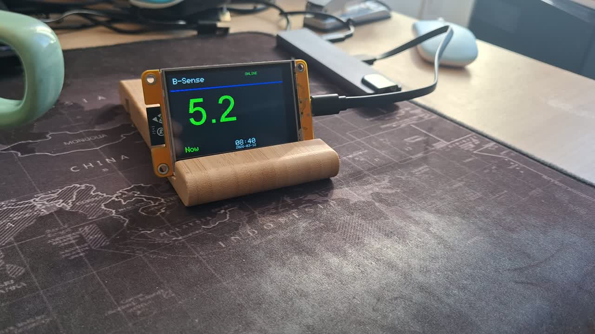
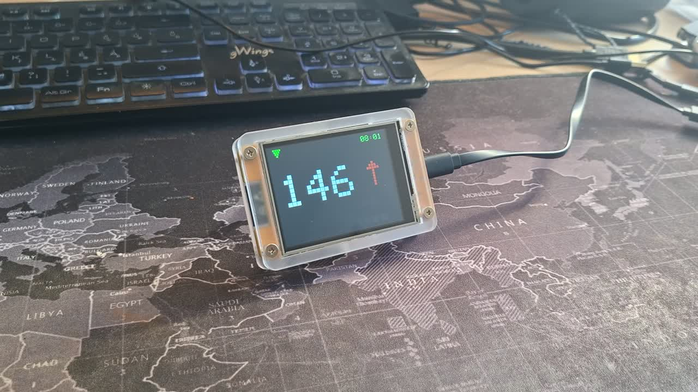
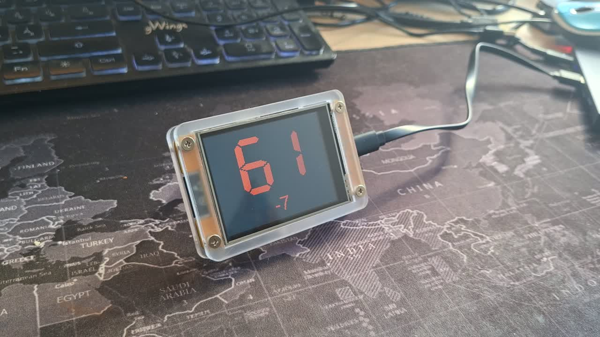
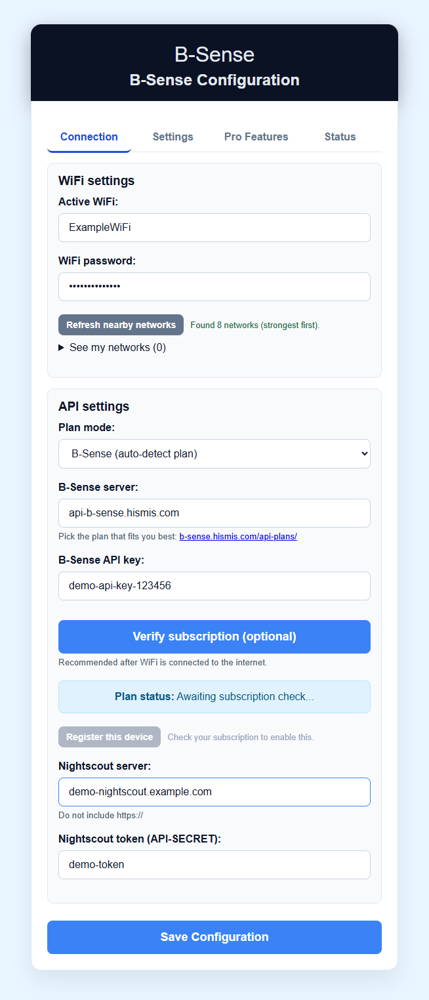

# B-Sense Versions

Public firmware delivery surface for B-Sense.

B-Sense is an always-on glucose display built around `ESP32 + ST7789`. It is designed to show the current glucose reading on a dedicated screen, so the most important number is visible without constantly checking a phone.

Current public setup paths:

- keep your own Nightscout path
- use the hosted B-Sense Cloud path

## What This Repo Contains

- the public OTA manifest
- the current public firmware binary
- shared ESP32 flashing support binaries
- public release notes for published firmware versions

## Product Preview

  

  
  
  

## Current Public Firmware

Model:

- `B-Sense ESP32 + ST7789`

Manifest:

- `versions/manifest.json`

Current binary:

- `versions/b-sense-esp32-st7789/b-sense-0.02.01.bin`

Current public release notes:

- `release-notes/v0.02.01.md`

## Product Documentation

- https://b-sense.hismis.com/documentation/
- https://b-sense.hismis.com/nightscout-vs-bsense-cloud/
- https://b-sense.hismis.com/nightscout-path/
- https://b-sense.hismis.com/xdrip-path/

## Notes For OTA Users

The OTA manifest includes a short one-line note shown in the device UI for each published version.

Example:

- `Public release: First public version.`
